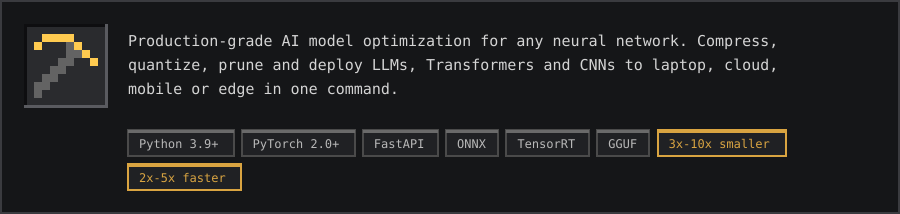
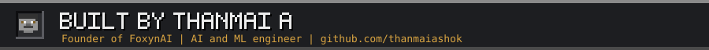

<p align="center"></p>
<p align="center"><sub>10-second tour: Load → Profile → Strategy → Compress → Evaluate → Export</sub></p>

<p align="center"></p>

<p align="center"></p>

<a id="what-it-does"></a>
<h2></h2>

OptiLLM takes any neural network and automatically selects the best optimization pipeline for your target hardware — no manual tuning required.

| Optimization | What it does |
|---|---|
| **Quantization** | FP16 / INT8 / INT4 / INT3 — shrinks model weight precision |
| **Pruning** | Sensitivity-based removal of low-impact weights |
| **Distillation** | Teacher-student compression for edge/mobile |
| **Strategy Selector** | Auto-picks the right pipeline for your target |
| **Reasoning Evaluator** | Multi-step logic scoring to guard accuracy |
| **Hardware Runtime** | TensorRT, ONNX Runtime, GGUF export |

<a id="quick-start"></a>
<h2></h2>

```bash
# Clone
git clone https://github.com/thanmaiashok/universal-optimizer.git
cd universal-optimizer

# Install (Python 3.9+)
pip install -e .

# Full install (GPU + mobile)
pip install -e ".[full]"

# Optimize a model
optillm optimize gpt2 --target mobile --preset balanced

# Profile hardware constraints
optillm profile ./model.pt

# Evaluate reasoning accuracy
optillm evaluate gpt2
```

<a id="python-api"></a>
<h2></h2>

```python
from opti_llm.core.optimizer import OptiLLMOptimizer, OptimizationConfig

config = OptimizationConfig(
    target_platform="mobile",   # laptop | cloud | mobile | edge
    preset="balanced",          # balanced | ultra_compression | max_accuracy | mobile_safe
    max_accuracy_drop=2.0       # % accuracy loss allowed
)

optimizer = OptiLLMOptimizer(config=config)
result = optimizer.optimize(model)

print(f"Compression:   {result.compression_ratio:.1f}x")
print(f"Latency gain:  {result.latency_improvement:.1f}x")
print(f"Accuracy drop: {result.accuracy_drop:.2f}%")
```

<a id="presets"></a>
<h2></h2>

| Preset | Compression | Accuracy kept | Best for |
|---|---|---|---|
| `balanced` | 2–4x | ~98% | General use |
| `ultra_compression` | 4–10x | ~95% | Mobile / Edge |
| `max_accuracy` | 1.5–2x | ~99% | Cloud / Production |
| `mobile_safe` | 2–3x | ~97% | Mobile deployments |

<a id="target-platforms"></a>
<h2></h2>

| Platform | Batch size | RAM limit | Default preset |
|---|---|---|---|
| `laptop` | 8 | 8 GB | balanced |
| `cloud` | 16 | 16 GB | max_accuracy |
| `mobile` | 1 | 2 GB | balanced |
| `edge` | 1 | 1 GB | ultra_compression |

<a id="rest-api-server"></a>
<h2></h2>

```bash
cd opti_llm/api
python main.py
# → http://localhost:8080
```

<a id="project-structure"></a>
<h2></h2>

```
opti_llm/
├── core/
│   ├── optimizer.py      # Main orchestrator (OptiLLMOptimizer)
│   ├── loader.py         # Universal model loader (HuggingFace, PyTorch, ONNX)
│   ├── profiler.py       # Multi-environment hardware profiler
│   ├── quantizer.py      # FP16/INT8/INT4/INT3 quantization engine
│   ├── pruner.py         # Sensitivity-based adaptive pruner
│   ├── distiller.py      # Knowledge distillation (teacher-student)
│   ├── evaluator.py      # Reasoning score + accuracy monitor
│   ├── strategy.py       # Auto pipeline selector
│   └── exporter.py       # PT / ONNX / GGUF export
├── optimizers/
│   ├── advanced_quantizer.py
│   ├── gguf_exporter.py
│   ├── tensorrt_runtime.py
│   └── thermal_manager.py
├── api/main.py           # FastAPI REST server
├── cli/main.py           # CLI entry point
└── utils/
    ├── batch_processor.py
    ├── mobile_export.py
    └── model_cards.py
examples/
└── run_examples.py
```

<a id="performance-targets"></a>
<h2></h2>

- Compression: **3x–10x** size reduction
- Latency: **2x–5x** faster inference
- Mobile size: **100–300 MB**
- RAM: **< 2 GB**

<a id="requirements"></a>
<h2></h2>

- Python 3.9+
- PyTorch 2.0+
- (Optional) CUDA for GPU quantization

<a id="contributing"></a>
<h2></h2>

Pull requests welcome. Open an issue first for large changes.

1. Fork the repo
2. Create a feature branch: `git checkout -b feat/your-feature`
3. Commit: `git commit -m "feat: add your feature"`
4. Push and open a PR

<a id="license"></a>
<h2></h2>

MIT © OptiLLM contributors

<p align="center"><a href="https://github.com/thanmaiashok"></a></p>
