

10-second tour: Load → Profile → Strategy → Compress → Evaluate → Export

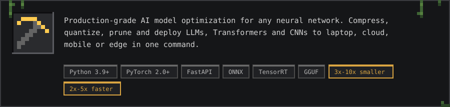


<h2></h2>

<h2></h2>

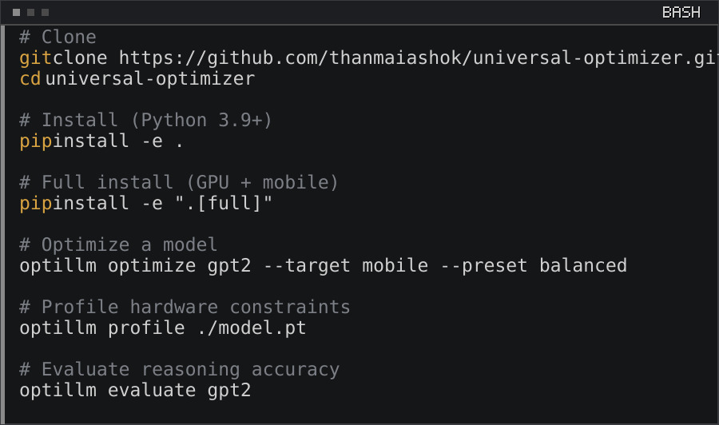

<h2></h2>

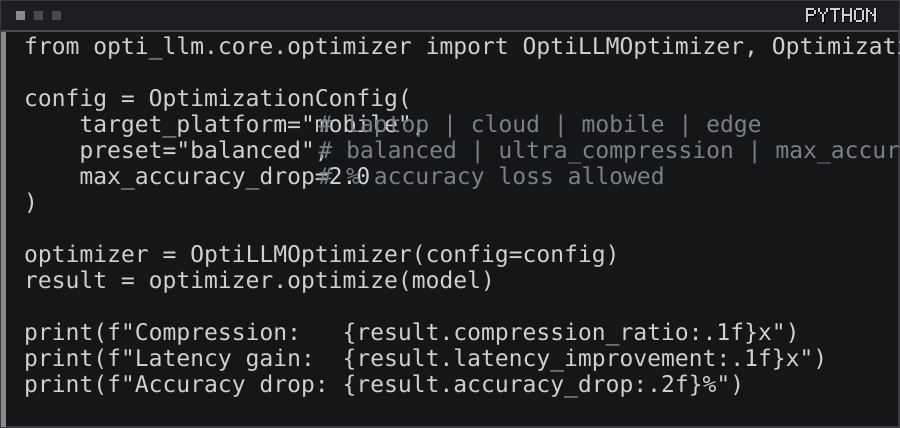

<h2></h2>

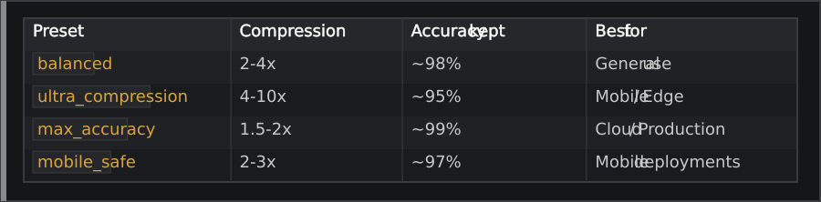

<h2></h2>

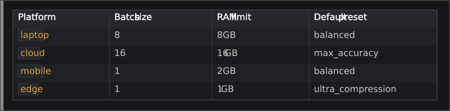

<h2></h2>

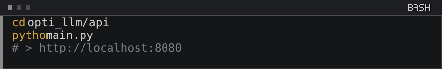

<h2></h2>

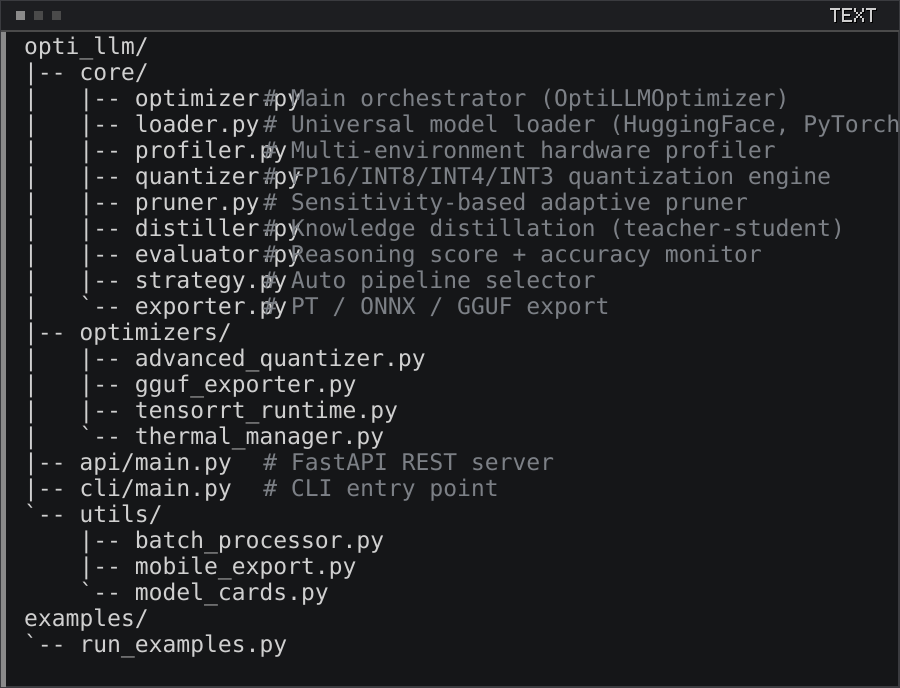

<h2></h2>

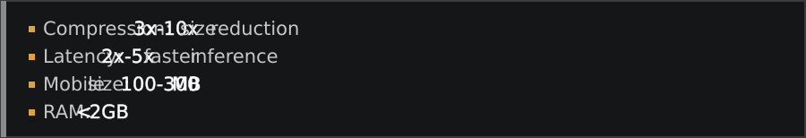

<h2></h2>

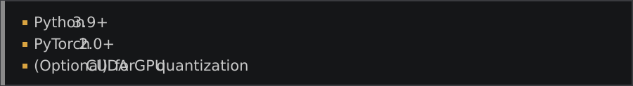

<h2></h2>

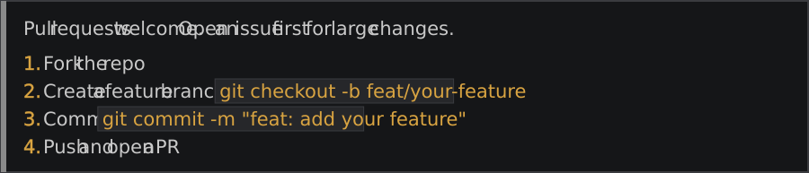

<h2></h2>

